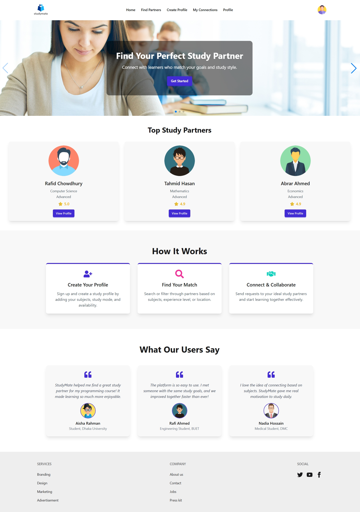

# StudyMate — Find Your Perfect Study Partner
# 📖 Preview   This is a modern React-based web application

**StudyMate** is a MERN Stack web platform designed to help students find and connect with study partners. Users can search for partners based on subjects, learning preferences, or location, making studying more interactive and goal-oriented.

---

## 🚀 Live Demo

*(https://study-mate-a10.web.app)*  

[Live Demo](#)

---

## 🛠 Tech Stack

**Frontend:**  
- React.js  
- React Router  
- Tailwind CSS  
- DaisyUI  
- React Icons  
- AOS (for animations)  
- React Toastify (for notifications)  

**Backend:**  
- Node.js  
- Express.js  
- MongoDB (Atlas)  
- Axios (for API requests)  

**Authentication:**  
- Firebase Authentication (Email/Password + Google Sign-In)

---

## ✨ Key Features

### Public Pages:
- **Home Page** with banner slider, top-rated study partners, “How It Works”, and testimonials section.
- **Find Partners**: View and search all available study partner profiles.
- **Details Page**: Full profile view of a selected study partner (private route).

### Authentication:
- **User Registration & Login** with email/password.
- **Google Social Sign-In**.
- Password validation rules:  
  - At least 1 uppercase letter  
  - At least 1 lowercase letter  
  - Minimum 6 characters

### Logged-In User Features:
- **Create Partner Profile**: Add personal study profile including name, subject, study mode, availability, location, experience level, and rating.  
- **My Connections**: View, update, or delete sent partner requests.  
- **Send Partner Request**: Increase partner count and add connection.  

### UI/UX Features:
- Responsive design using Tailwind CSS and DaisyUI.  
- Smooth navigation using React Router (no reloads).  
- Toast notifications for successful/failed actions.  
- Loading spinner while fetching data.  
- Creative error/404 page.

---

# React + Vite

This template provides a minimal setup to get React working in Vite with HMR and some ESLint rules.

Currently, two official plugins are available:

- [@vitejs/plugin-react](https://github.com/vitejs/vite-plugin-react/blob/main/packages/plugin-react) uses [Babel](https://babeljs.io/) (or [oxc](https://oxc.rs) when used in [rolldown-vite](https://vite.dev/guide/rolldown)) for Fast Refresh
- [@vitejs/plugin-react-swc](https://github.com/vitejs/vite-plugin-react/blob/main/packages/plugin-react-swc) uses [SWC](https://swc.rs/) for Fast Refresh

## React Compiler

The React Compiler is not enabled on this template because of its impact on dev & build performances. To add it, see [this documentation](https://react.dev/learn/react-compiler/installation).

## Expanding the ESLint configuration

If you are developing a production application, we recommend using TypeScript with type-aware lint rules enabled. Check out the [TS template](https://github.com/vitejs/vite/tree/main/packages/create-vite/template-react-ts) for information on how to integrate TypeScript and [`typescript-eslint`](https://typescript-eslint.io) in your project.
